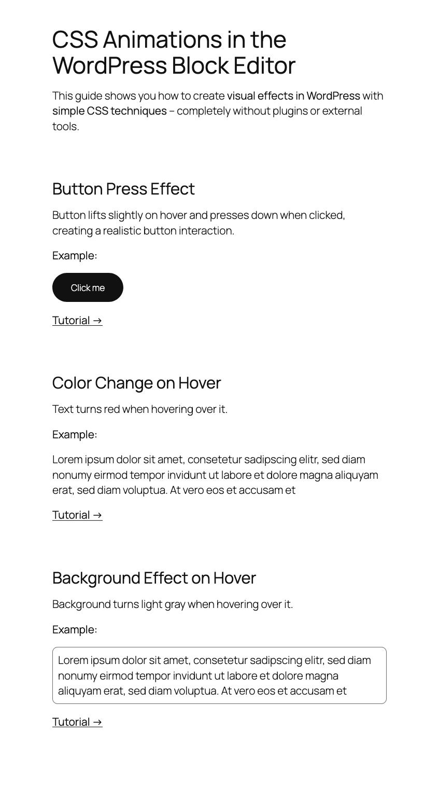

# WordPress Block Editor Examples

[](https://opensource.org/licenses/MIT)
[](https://github.com/rfluethi/WordPress-Playgrounds/issues)
[](https://github.com/rfluethi/WordPress-Playgrounds/stargazers)
[](https://playground.wordpress.net/)

Welcome to the WordPress Block Editor Examples repository! This collection demonstrates advanced techniques for working with the WordPress Block Editor, focusing on modern CSS animations, responsive layouts, and interactive design patterns. Each example includes complete tutorials and can be tested instantly in your browser.

## Table of Contents

- [WordPress Block Editor Examples](#wordpress-block-editor-examples)
  - [Table of Contents](#table-of-contents)
  - [Who This Is For](#who-this-is-for)
  - [Available Examples](#available-examples)
    - [Column Example](#column-example)
    - [CSS Animations Example](#css-animations-example)
  - [Quick Start](#quick-start)
    - [Option 1: Live Demo (No Installation)](#option-1-live-demo-no-installation)
    - [Option 2: Download and Use](#option-2-download-and-use)
    - [Option 3: Study the Code](#option-3-study-the-code)
  - [Repository Structure](#repository-structure)
  - [Implementation Guide](#implementation-guide)
  - [Learning Resources](#learning-resources)
  - [Frequently Asked Questions](#frequently-asked-questions)
    - [Can I use these techniques on my live site?](#can-i-use-these-techniques-on-my-live-site)
    - [Do I need plugins for these effects?](#do-i-need-plugins-for-these-effects)
    - [How do I implement these in my theme?](#how-do-i-implement-these-in-my-theme)
    - [Are these techniques mobile-friendly?](#are-these-techniques-mobile-friendly)
    - [Can I customize the animations?](#can-i-customize-the-animations)
  - [Contributing](#contributing)
    - [How to Contribute](#how-to-contribute)
    - [Example Guidelines](#example-guidelines)
  - [License](#license)
  - [Acknowledgments](#acknowledgments)

## Who This Is For

This repository is perfect for:

- **WordPress developers** learning modern CSS animations and effects in the Block Editor
- **Content creators** who want to add visual appeal and interactivity to their pages
- **Educators** teaching contemporary CSS techniques and WordPress best practices
- **Designers** exploring interaction possibilities and visual effects in WordPress
- **Theme developers** looking to implement advanced Block Editor features

Whether you're building client sites, creating educational content, or simply want to make your WordPress pages more engaging, these examples provide practical, copy-paste solutions.

## Available Examples

### Column Example


**[Try Live Demo](https://playground.wordpress.net/?blueprint-url=https://raw.githubusercontent.com/rfluethi/WordPress-Playgrounds/main/column-example/blueprint.json)** | **[Read Tutorial](column-example/column-example-tutorial.md)**

Master responsive layouts with WordPress Column blocks. This example teaches professional layout techniques using CSS Grid and Flexbox within the Block Editor.

**What You'll Learn:**
- Advanced multi-column responsive layouts
- CSS Grid and Flexbox implementation in WordPress
- Mobile-first design principles
- Professional spacing and alignment techniques

**Perfect For:** Developers building complex layouts, designers implementing responsive designs, content creators wanting professional page structures.

---

### CSS Animations Example



**[Try Live Demo](https://playground.wordpress.net/?blueprint-url=https://raw.githubusercontent.com/rfluethi/WordPress-Playgrounds/main/css-animations-example/blueprint.json)** | **[Read Tutorial](css-animations-example/css-animations-example-tutorial.md)**

Transform your WordPress content with engaging CSS animations. Learn to create smooth hover effects, transitions, and keyframe animations using only CSS—no plugins required.

**What You'll Learn:**
- Hover effects and smooth transitions for blocks
- Professional keyframe animations
- CSS-only interactive elements
- Performance-optimized animation techniques
- Copy-paste animation classes for immediate use

**Animation Types Included:**
- Fade In/Out effects
- Slide animations (up, down, left, right)
- Scale and zoom effects
- Rotation and flip animations
- Stagger animations for multiple elements

**Perfect For:** WordPress developers adding interactivity, content creators enhancing visual appeal, educators teaching modern CSS, designers exploring WordPress interaction possibilities.

## Quick Start

### Option 1: Live Demo (No Installation)

Experience the examples instantly in your browser:

1. **CSS Animations Demo**: Click [Try Live Demo](https://playground.wordpress.net/?blueprint-url=https://raw.githubusercontent.com/rfluethi/WordPress-Playgrounds/main/css-animations-example/blueprint.json)
2. **Column Layouts Demo**: Click [Try Live Demo](https://playground.wordpress.net/?blueprint-url=https://raw.githubusercontent.com/rfluethi/WordPress-Playgrounds/main/column-example/blueprint.json)
3. **Explore the Block Editor**: Edit content, apply CSS classes, and see the effects live
4. **Copy the CSS**: Use your browser's developer tools to copy styles you like

### Option 2: Download and Use

Implement these techniques on your WordPress site:

1. **Download the CSS**: Copy animation styles from `/css-animations-theme/style.css`
2. **Add to your theme**: Paste CSS into your active theme's style.css or Additional CSS
3. **Apply CSS classes**: Use the Block Editor's Advanced panel to add classes
4. **Customize**: Modify colors, timings, and effects to match your design

### Option 3: Study the Code

Learn by examining the implementation:

```bash
git clone https://github.com/rfluethi/WordPress-Playgrounds.git
cd WordPress-Playgrounds
```

**Key Files to Study:**
- `css-animations-theme/style.css` - All animation CSS code
- `css-animations-example.xml` - WordPress content with applied classes  
- `css-animations-example-tutorial.md` - Step-by-step implementation guide
- `column-example/column-example-tutorial.md` - Advanced layout techniques

## Repository Structure

```text
WordPress-Playgrounds/
├── column-example/
│   ├── blueprint.json              # WordPress Playground configuration
│   ├── column-example.xml         # Sample layout content
│   ├── column-example.png         # Preview image
│   ├── column-example-tutorial.md # Step-by-step tutorial
│   └── README.md                  # Implementation guide
│
├── css-animations-example/
│   ├── blueprint.json              # WordPress Playground configuration
│   ├── css-animations-theme.zip    # Complete Block Theme with animations
│   ├── css-animations-theme/       # Theme source files
│   │   ├── style.css              # Main CSS animations file
│   │   ├── theme.json             # Block Editor configuration
│   │   └── patterns/              # Reusable block patterns
│   ├── css-animations-example.xml  # Sample content with applied animations
│   ├── css-animations-example-tutorial.md # Complete tutorial
│   ├── css-animations-example.png  # Preview image
│   └── README.md                  # Quick start guide
│
└── README.md                      # This file
```

## Implementation Guide

### Adding Animations to Your Site

1. **Copy the CSS**: Take animation styles from `css-animations-theme/style.css`

2. **Add to WordPress**: 
   - **Theme Method**: Add CSS to your theme's `style.css`
   - **Customizer Method**: Use Appearance → Customize → Additional CSS
   - **Plugin Method**: Use a custom CSS plugin

3. **Apply to Blocks**:
   - Select any block in the Block Editor
   - Open the "Advanced" panel in the sidebar
   - Add CSS class names like `animate-fade-in`, `animate-slide-up`, etc.

4. **Customize**: Modify colors, timing, and effects in the CSS to match your design

### CSS Classes Available

The examples include these ready-to-use animation classes:

- `animate-fade-in` - Smooth fade in effect
- `animate-slide-up` - Slide up from bottom
- `animate-slide-down` - Slide down from top
- `animate-scale-in` - Scale from small to normal
- `animate-rotate-in` - Rotate while fading in
- `hover-lift` - Lift effect on hover
- `hover-glow` - Glow effect on hover

### Block Editor Integration

All examples work seamlessly with WordPress blocks:

- **Native WordPress blocks** (Paragraph, Image, Button, etc.)
- **Theme blocks** (Query Loop, Navigation, etc.)  
- **Plugin blocks** (WooCommerce, Contact forms, etc.)
- **Custom blocks** (Your own block development)

Simply add the CSS class to any block's Advanced settings.

## Learning Resources

### Official Documentation

- **[WordPress Block Editor Handbook](https://developer.wordpress.org/block-editor/)** - Official guide to Block Editor development
- **[Theme Developer Handbook](https://developer.wordpress.org/themes/)** - WordPress theme development best practices
- **[CSS Animation Guide](https://developer.mozilla.org/en-US/docs/Web/CSS/CSS_Animations)** - MDN's comprehensive CSS animation reference

### Recommended Learning Path

1. **Start with Column Example** - Learn responsive layout fundamentals
2. **Study CSS Animations** - Add interactivity and visual appeal
3. **Read the Tutorials** - Follow step-by-step implementation guides
4. **Experiment in Playground** - Test your ideas safely
5. **Implement on Your Site** - Apply techniques to real projects

### Community Resources

- **[WordPress Developer Blog](https://developer.wordpress.org/news/)** - Latest Block Editor updates
- **[WordPress TV](https://wordpress.tv/)** - Video tutorials and conference talks
- **[Make WordPress Core](https://make.wordpress.org/core/)** - Contribute to Block Editor development

## Frequently Asked Questions

### Can I use these techniques on my live site?

Yes! All examples use standard WordPress features and CSS. Copy the CSS code from the examples and add it to your theme's stylesheet or use WordPress's Additional CSS feature in the Customizer.

### Do I need plugins for these effects?

No plugins required! All animations and effects use pure CSS and work with WordPress's built-in Block Editor. This ensures better performance and compatibility.

### How do I implement these in my theme?

1. Copy CSS from `css-animations-theme/style.css`
2. Add to your theme's `style.css` file
3. Apply CSS classes using the Block Editor's Advanced panel
4. Customize colors and timing to match your design

### Are these techniques mobile-friendly?

Yes! All examples follow mobile-first responsive design principles. Animations are optimized for performance and include `prefers-reduced-motion` media queries for accessibility.

### Can I customize the animations?

Absolutely! The CSS is written to be easily customizable. Modify durations, easing functions, colors, and effects to match your brand and design requirements.

## Contributing

We welcome contributions! Whether you want to:

- **Add new Block Editor examples**: Create demonstrations of CSS techniques, layout patterns, or interactive features
- **Improve existing examples**: Enhance CSS animations, add more responsive breakpoints, or expand tutorials
- **Fix issues**: Help maintain the repository and improve documentation
- **Share educational content**: Contribute tutorials, guides, or best practice examples

### How to Contribute

1. **Fork** this repository
2. **Create** a new branch: `git checkout -b feature/new-css-technique`
3. **Add your example**: Include CSS files, documentation, and live demo setup
4. **Test thoroughly**: Ensure examples work in the Block Editor and across devices
5. **Submit** a pull request with clear documentation

### Example Guidelines

When contributing new examples:

- **Focus on education**: Explain the technique and its practical applications
- **Provide complete code**: Include all CSS, HTML structure examples, and implementation guides
- **Test responsiveness**: Ensure techniques work on mobile, tablet, and desktop
- **Follow accessibility**: Include proper contrast, reduced motion preferences, and keyboard navigation
- **Document everything**: Clear README files with step-by-step instructions
- **Use semantic classes**: CSS class names should be descriptive and reusable

## License

This project is licensed under the MIT License - see the [LICENSE](LICENSE) file for details.

## Acknowledgments

- **WordPress Community** - For the amazing Block Editor and continuous innovation
- **WordPress Playground Team** - For making browser-based WordPress testing possible
- **CSS Animation Community** - For inspiring creative and accessible web animations
- **Contributors** - Everyone who helps improve these educational resources

---

**Happy coding!**

*Made with love for the WordPress community*
