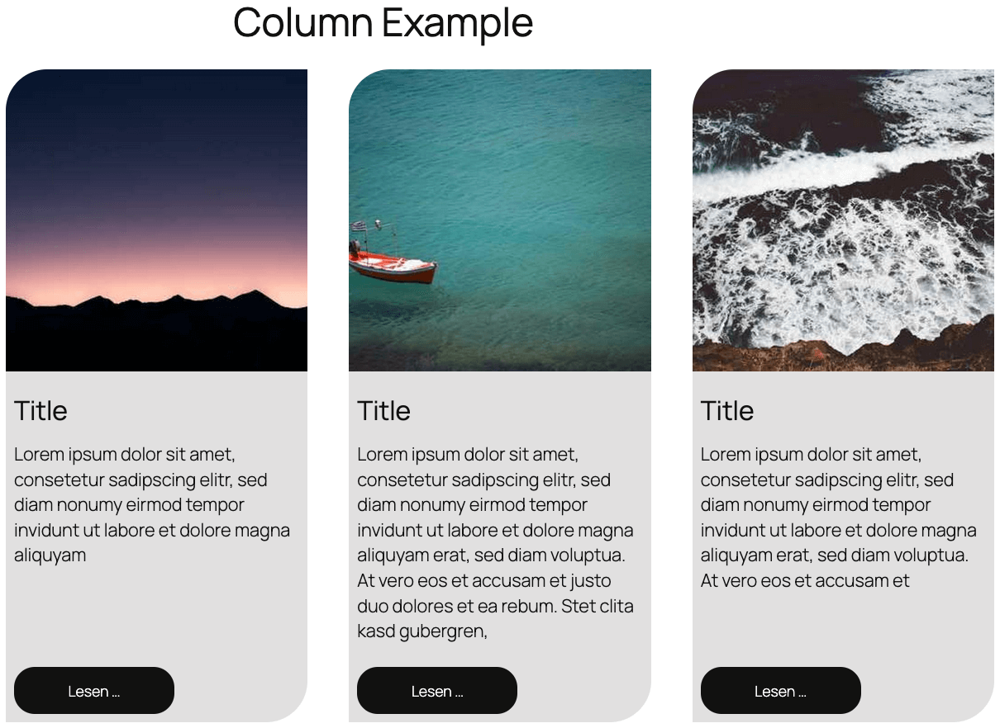

# WordPress Playgrounds

[](https://opensource.org/licenses/MIT)
[](https://github.com/rfluethi/WordPress-Playgrounds/issues)
[](https://github.com/rfluethi/WordPress-Playgrounds/stargazers)
[](https://playground.wordpress.net/)

Welcome to the WordPress Playgrounds repository! This collection of interactive blueprints demonstrates various WordPress features and use cases through the WordPress Playground platform. Each example provides hands-on learning experiences with real WordPress environments.

## 📚 Table of Contents

- [WordPress Playgrounds](#wordpress-playgrounds)
  - [📚 Table of Contents](#-table-of-contents)
  - [What is WordPress Playground?](#what-is-wordpress-playground)
  - [Available Examples](#available-examples)
    - [Import Example](#import-example)
    - [Column Example](#column-example)
  - [Quick Start](#quick-start)
    - [Option 1: Use Pre-built Examples](#option-1-use-pre-built-examples)
    - [Option 2: Clone and Customize](#option-2-clone-and-customize)
    - [Option 3: Create Your Own Blueprint](#option-3-create-your-own-blueprint)
  - [Repository Structure](#repository-structure)
  - [Blueprint Configuration](#blueprint-configuration)
  - [Learning Resources](#learning-resources)
  - [🙋‍♀️ Frequently Asked Questions](#️-frequently-asked-questions)
    - [What is a Blueprint?](#what-is-a-blueprint)
    - [Can I use these examples on my live site?](#can-i-use-these-examples-on-my-live-site)
    - [How do I create my own blueprint?](#how-do-i-create-my-own-blueprint)
    - [Are there any limitations?](#are-there-any-limitations)
    - [Can I save my work from the Playground?](#can-i-save-my-work-from-the-playground)
  - [Contributing](#contributing)
    - [How to Contribute](#how-to-contribute)
    - [Blueprint Guidelines](#blueprint-guidelines)
  - [License](#license)
  - [Acknowledgments](#acknowledgments)

## What is WordPress Playground?

WordPress Playground allows you to run WordPress directly in your browser without any installation. These blueprints automatically configure WordPress environments with specific content and features, making it perfect for:

- **Learning WordPress**: Explore features without setup complexity
- **Testing Ideas**: Experiment with layouts and functionality
- **Demonstrations**: Show WordPress capabilities to clients or students
- **Development**: Prototype and test before implementing on live sites

## Available Examples

### Import Example

<a href="import-example/">
  
</a>

**📋 Demonstrates**: WordPress content import functionality using WXR files  
**🎯 Difficulty**: Beginner  
**⏱️ Setup Time**: < 1 minute  
**🔧 Use Cases**: Content migration, site setup, bulk imports  

This example shows how to automatically import posts, pages, and media into a WordPress site using the WordPress Playground. Perfect for understanding how content migration works and testing import processes without affecting live sites.

**Features**:

- Automatic WXR file import
- Sample posts and pages
- Media file handling
- Import process demonstration

**Try it**: [Launch Import Example](https://playground.wordpress.net/?mode=seamless&blueprint-url=https://raw.githubusercontent.com/rfluethi/WordPress-Playgrounds/main/import-example/blueprint.json)

**Documentation**: [View import-example directory](import-example/)

---

### Column Example

<a href="column-example/">
  
</a>

**📋 Demonstrates**: Advanced three-column WordPress block layouts with automatic height adjustment  
**🎯 Difficulty**: Intermediate  
**⏱️ Setup Time**: < 1 minute  
**🔧 Use Cases**: Layout design, responsive columns, button alignment  

This example showcases how to create responsive column layouts that maintain consistent button alignment regardless of content length - a common challenge in WordPress design. Ideal for learning advanced block editor techniques.

**Features**:

- Three-column responsive layout
- Automatic height adjustment
- Consistent button alignment
- Professional styling with rounded corners
- Mobile-responsive design

**Try it**: [Launch Column Example](https://playground.wordpress.net/?mode=seamless&blueprint-url=https://raw.githubusercontent.com/rfluethi/WordPress-Playgrounds/main/column-example/blueprint.json)

**Documentation**: [View column-example directory](column-example/)

## Quick Start

### Option 1: Use Pre-built Examples

Click any "Try it" link above to instantly launch a WordPress environment with the example loaded.

### Option 2: Clone and Customize

```bash
git clone https://github.com/rfluethi/WordPress-Playgrounds.git
cd WordPress-Playgrounds
```

Then modify any blueprint.json file to customize the WordPress environment.

### Option 3: Create Your Own Blueprint

Use this URL structure with your own blueprint:

```url
https://playground.wordpress.net/?mode=seamless&blueprint-url=YOUR_BLUEPRINT_URL
```

## Repository Structure

```text
WordPress-Playgrounds/
├── README.md
├── import-example/
│   ├── blueprint.json          # Playground configuration
│   ├── import.xml             # Sample content to import
│   ├── import-example.png     # Example screenshot
│   └── README.md              # Detailed documentation
├── column-example/
│   ├── blueprint.json          # Playground configuration
│   ├── column-example.xml      # Column layout content
│   ├── column-example.png      # Example screenshot
│   └── README.md              # Detailed documentation
└── LICENSE
```

## Blueprint Configuration

Each blueprint is a JSON file that configures the WordPress Playground environment:

```json
{
  "$schema": "https://playground.wordpress.net/blueprint-schema.json",
  "preferredVersions": {
    "php": "latest",
    "wp": "latest"
  },
  "steps": [
    {
      "step": "importWxr",
      "file": {
        "resource": "url",
        "url": "https://your-content-url.xml"
      }
    }
  ],
  "login": true,
  "landingPage": "/wp-admin/edit.php"
}
```

## Learning Resources

- **WordPress Playground Documentation**: [playground.wordpress.net](https://playground.wordpress.net/)
- **Blueprint Schema**: [Blueprint JSON Schema](https://playground.wordpress.net/blueprint-schema.json)
- **WordPress Block Editor**: [Block Editor Handbook](https://developer.wordpress.org/block-editor/)

## 🙋‍♀️ Frequently Asked Questions

### What is a Blueprint?
A blueprint is a JSON configuration file that tells WordPress Playground how to set up a WordPress environment. It can include plugins, themes, content, and configurations.

### Can I use these examples on my live site?
These examples are designed for learning and testing. While the techniques can be applied to live sites, always test thoroughly in a staging environment first.

### How do I create my own blueprint?
Start by examining the existing `blueprint.json` files in this repository. The [Blueprint Schema](https://playground.wordpress.net/blueprint-schema.json) provides full documentation of available options.

### Are there any limitations?
WordPress Playground runs in the browser, so some server-specific features may not work. It's perfect for testing layouts, content, and most WordPress functionality.

### Can I save my work from the Playground?
WordPress Playground is temporary - changes are lost when you close the browser. Use it for testing and learning, then implement solutions on your actual site.

## Contributing

We welcome contributions! Whether you want to:

- **Add new examples**: Create blueprints for different WordPress features
- **Improve existing examples**: Enhance functionality or documentation
- **Fix issues**: Help maintain the repository
- **Share ideas**: Suggest new demonstration scenarios

### How to Contribute

1. **Fork** this repository
2. **Create** a new branch: `git checkout -b feature/new-example`
3. **Add** your example in a new directory with:
   - `blueprint.json` - Playground configuration
   - `content.xml` - Sample content (if needed)
   - `README.md` - Documentation
   - `screenshot.png` - Visual preview
4. **Test** your blueprint thoroughly
5. **Submit** a pull request

### Blueprint Guidelines

- Use descriptive directory names
- Include comprehensive README documentation
- Provide working example URLs
- Add screenshots for visual reference
- Test across different browsers
- Keep configurations simple and focused

## License

This project is licensed under the [MIT License](LICENSE). Feel free to use, modify, and distribute these examples for educational and commercial purposes.

## Acknowledgments

- **WordPress Community**: For creating an amazing platform
- **WordPress Playground Team**: For making browser-based WordPress possible
- **Contributors**: Everyone who helps improve these examples

---

**Ready to explore WordPress?** Choose an example above and start learning!

For questions or support, please [open an issue](https://github.com/rfluethi/WordPress-Playgrounds/issues).
