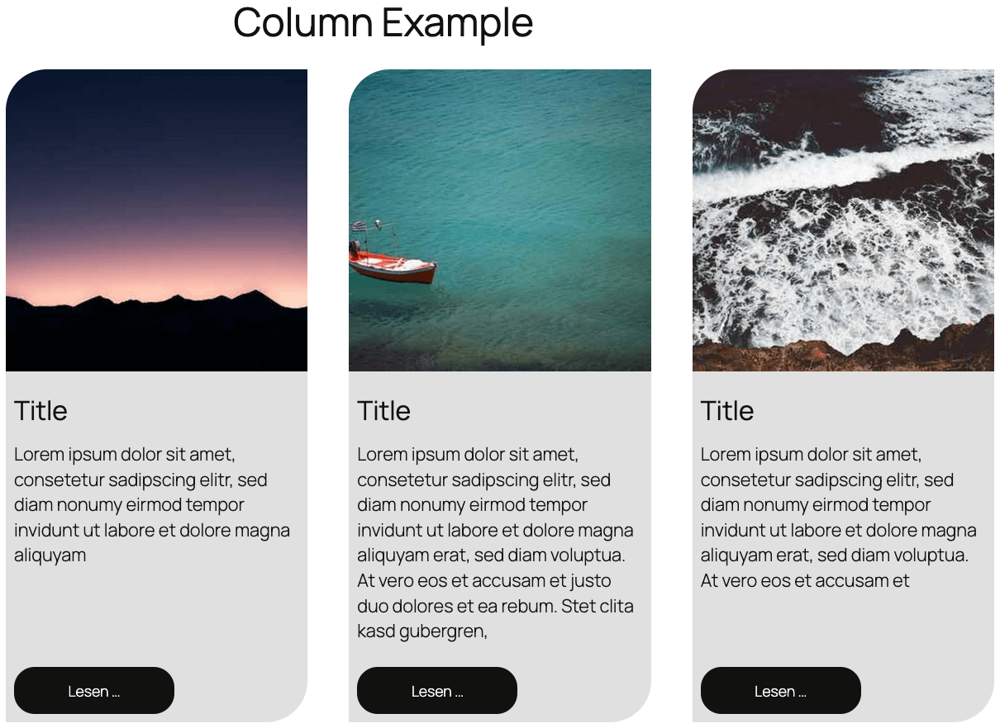

# WordPress Column Layout Example

This directory demonstrates how to create **professional responsive column layouts** in WordPress using the **Block Editor** with equal-height cards and perfect button alignment.



## Live Demo

```url
https://playground.wordpress.net/?blueprint-url=https://raw.githubusercontent.com/rfluethi/WordPress-Playgrounds/main/column-example/blueprint.json
```

## Documentation

For a complete step-by-step tutorial on creating these column layouts, see the [Column Layout Tutorial](column-example-tutorial.md).

## What This Example Shows

This WordPress Playground demonstrates advanced **column layout techniques** that solve common design challenges in the WordPress Block Editor:

### Layout Features

- **Equal Height Cards** - All columns maintain the same height regardless of content length
- **Flexible Content Areas** - Text areas expand to fill available space
- **Bottom-Aligned Buttons** - Buttons always appear at the bottom of each card
- **Professional Styling** - Rounded corners and consistent spacing
- **Responsive Design** - Adapts to different screen sizes automatically

### The Problem This Solves

When creating multi-column layouts in WordPress, content of varying lengths often causes:
- Misaligned buttons across columns
- Inconsistent card heights
- Unprofessional appearance
- Poor user experience

This example provides a **CSS-only solution** using WordPress Block Editor features.

### Implementation Techniques

- **CSS Flexbox** - For equal height columns
- **Stack Blocks** - For flexible content arrangement
- **Dimension Controls** - For proper spacing and sizing
- **Transform Options** - Converting between block types
- **Border Radius** - For modern rounded corner styling

## How It Works

1. **Group Structure**: Content is organized into grouped stacks within columns
2. **Height Control**: Minimum height of 100% ensures equal column heights
3. **Flexible Growth**: Content areas use "Grow" dimension to fill available space
4. **Button Positioning**: Buttons remain at bottom through flexbox alignment
5. **Responsive Behavior**: WordPress Column blocks handle mobile responsiveness

## Key WordPress Features Used

- **Column Blocks** - WordPress native responsive columns
- **Group Blocks** - For organizing and styling content sections
- **Stack Blocks** - For vertical content arrangement with flex properties
- **Dimension Controls** - Built-in WordPress spacing and sizing options
- **Transform Tools** - Converting between different block types

Perfect for: **Product showcases**, **service listings**, **team member cards**, **feature comparisons**, and any layout requiring consistent card appearance.

- Uses native WordPress blocks
- Compatible with the block editor
- No custom plugins required
- Mobile-responsive out of the box

## Directory Structure

```text
/column-example/
├── blueprint.json
├── column-example.png
└── column-example.xml
```
